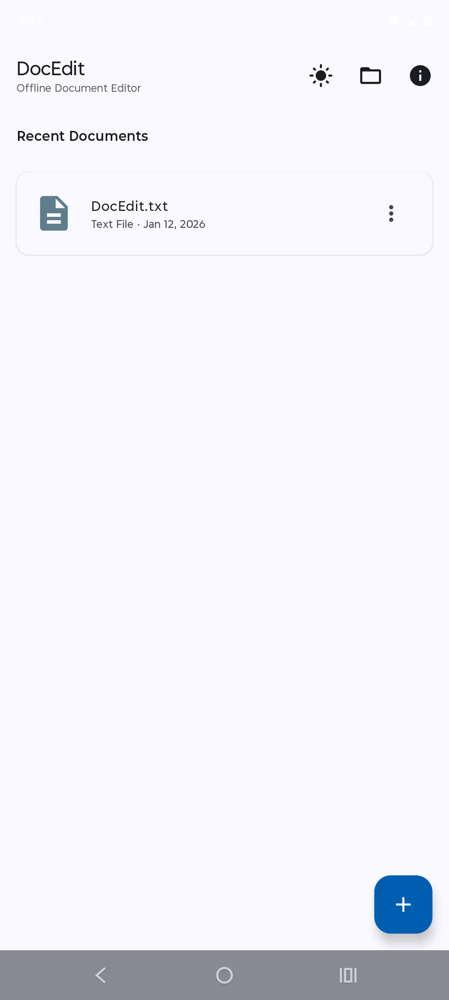
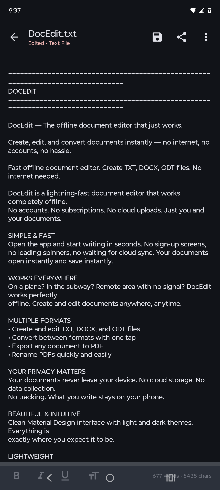
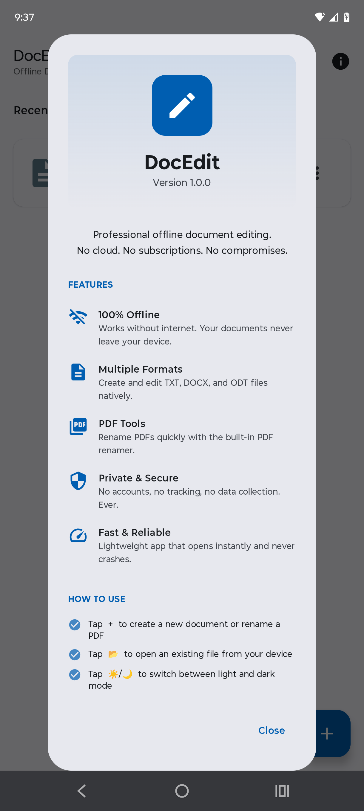

<p align="center">
  
</p>

<h1 align="center">DocEdit</h1>

<p align="center">
  <strong>Offline-First Document Editor for Android</strong><br>
  Create, edit, and convert TXT, DOCX, and ODT files — no internet required
</p>

<p align="center">
  <a href="#features">Features</a> •
  <a href="#screenshots">Screenshots</a> •
  <a href="#architecture">Architecture</a> •
  <a href="#getting-started">Getting Started</a> •
  <a href="#license">License</a>
</p>

<p align="center">
  
  
  
  
  
</p>

---

## Why DocEdit?

Most document editors require constant internet connectivity, cloud accounts, and subscriptions. **DocEdit takes a different approach:**

| Problem | DocEdit Solution |
|---------|------------------|
| 🌐 Requires internet | ✅ **100% offline** — works in airplane mode |
| 💳 Monthly subscriptions | ✅ **One-time purchase** — no recurring fees |
| ☁️ Cloud storage required | ✅ **Local-first** — your files stay on your device |
| 📊 Tracks your data | ✅ **Zero telemetry** — no accounts, no tracking |
| 📦 Bloated apps (100MB+) | ✅ **Lightweight** — 4mb download |

**Built for reliability. Built to last.**

---

## Features

### Document Formats

| Format | Create | Edit | Save As | Export To |
|--------|--------|------|---------|-----------|
| **TXT** | ✅ | ✅ | ✅ | DOCX, ODT, PDF |
| **DOCX** | ✅ | ✅ | ✅ | TXT, ODT, PDF |
| **ODT** | ✅ | ✅ | ✅ | TXT, DOCX, PDF |
| **PDF** | — | — | ✅ Rename | — |

### Core Capabilities

📝 **Document Editing**
- Create new TXT, DOCX, and ODT documents
- Open and edit existing files from any location
- Auto-save with manual save option
- Undo/redo support

🔄 **Format Conversion**
- Convert between TXT, DOCX, and ODT seamlessly
- Export any document to PDF
- Preserve formatting during conversion

📕 **PDF Tools**
- Quick PDF rename utility
- Pick any PDF → Enter new name → Save copy
- No PDF viewer bloat — uses your preferred PDF app

🎨 **Modern UI**
- Material Design 3 with dynamic colors
- Light and dark theme support
- System theme following option
- Clean, intuitive interface

📱 **Android Integration**
- Share documents to any app
- Open files from any file manager
- Recent documents for quick access
- Works on Android 8.0+ (API 26+)

---

## Screenshots

<p align="center">
  <i>Screenshots coming soon</i>
</p>

<!-- 
<p align="center">
  
  
  
  
</p>
-->

---

## Architecture

DocEdit follows **Clean Architecture** principles with **MVVM** presentation layer:

```
┌─────────────────────────────────────────────────────────────┐
│                      PRESENTATION                            │
│  ┌─────────────────┐        ┌─────────────────┐             │
│  │  BrowserScreen  │        │  EditorScreen   │             │
│  │   • Home view   │        │  • Text editing │             │
│  │   • Recent docs │        │  • Format tools │             │
│  │   • PDF rename  │        │  • Save/export  │             │
│  └────────┬────────┘        └────────┬────────┘             │
│           │                          │                       │
│  ┌────────▼────────┐        ┌────────▼────────┐             │
│  │ BrowserViewModel│        │ EditorViewModel │             │
│  └────────┬────────┘        └────────┬────────┘             │
└───────────┼──────────────────────────┼───────────────────────┘
            │                          │
            └────────────┬─────────────┘
                         │
┌────────────────────────▼────────────────────────────────────┐
│                         DATA                                 │
│  ┌────────────────────────────────────────────────────┐     │
│  │              DocumentRepository                     │     │
│  │  • openDocument()  • saveDocument()  • saveAs()   │     │
│  │  • exportToPdf()   • copyDocument()  • rename()   │     │
│  └───────────────────────┬────────────────────────────┘     │
│                          │                                   │
│  ┌──────────┬────────────┼────────────┬──────────┐          │
│  │          │            │            │          │          │
│  ▼          ▼            ▼            ▼          ▼          │
│ ┌────┐  ┌──────┐    ┌──────┐    ┌──────┐   ┌────────┐      │
│ │Txt │  │ Docx │    │ Odt  │    │ Pdf  │   │  File  │      │
│ │ IO │  │  IO  │    │  IO  │    │Export│   │Manager │      │
│ └────┘  └──────┘    └──────┘    └──────┘   └────────┘      │
└─────────────────────────────────────────────────────────────┘
                         │
┌────────────────────────▼────────────────────────────────────┐
│                        DOMAIN                                │
│  ┌─────────────┐  ┌───────────────┐  ┌──────────────────┐   │
│  │  Document   │  │DocumentFormat │  │ DocumentResult<T>│   │
│  │   (model)   │  │    (enum)     │  │  (sealed class)  │   │
│  └─────────────┘  └───────────────┘  └──────────────────┘   │
└─────────────────────────────────────────────────────────────┘
```

### Design Principles

| Principle | Implementation |
|-----------|----------------|
| **Offline-First** | No network calls, ever. All processing on-device. |
| **Zero Dependencies** | DOCX/ODT parsed with built-in XML + ZIP APIs |
| **Type Safety** | Sealed Result classes for error handling |
| **Lifecycle Aware** | StateFlow survives configuration changes |
| **Storage Access Framework** | Proper file access without permission headaches |

---

## Tech Stack

| Category | Technology |
|----------|------------|
| **Language** | Kotlin 2.0 |
| **UI Framework** | Jetpack Compose |
| **Design System** | Material Design 3 |
| **Architecture** | MVVM + Clean Architecture |
| **Navigation** | Navigation Compose |
| **Async** | Kotlin Coroutines + StateFlow |
| **Preferences** | DataStore |
| **Min SDK** | 31 (Android 12.0) |
| **Target SDK** | 36 (Android 16) |

---

## Getting Started

### Prerequisites
- Android Studio Ladybug (2024.2.1) or later
- JDK 17+
- Android SDK 36

### Build

```bash
# Clone the repository
git clone https://github.com/mcmlv1/DocEdit.git
cd DocEdit

# Build debug APK
./gradlew assembleDebug

# Install on connected device
./gradlew installDebug

# Run tests
./gradlew test
```

### Project Structure

```
app/src/main/java/com/mcmlv1/docedit/
├── data/
│   ├── converter/       # TXT, DOCX, ODT, PDF converters
│   ├── repository/      # DocumentRepository
│   └── storage/         # FileManager, Settings, RecentDocs
├── domain/
│   └── model/           # Document, DocumentFormat, Result
└── presentation/
    ├── browser/         # Home screen + About dialog
    ├── editor/          # Text editor
    ├── common/          # Shared UI state classes
    ├── theme/           # Material 3 theming
    └── MainActivity.kt  # Navigation host
```

---

## Roadmap

- [x] TXT, DOCX, ODT editing
- [x] PDF export
- [x] PDF rename utility
- [x] Dark mode + system theme
- [x] Material 3 + dynamic colors
- [ ] Markdown (.md) support
- [ ] RTF support
- [ ] Find & replace
- [ ] Word count statistics
- [ ] Tablet-optimized layout

---

## Contributing

Contributions are welcome! Please feel free to submit a Pull Request.

1. Fork the repository
2. Create your feature branch (`git checkout -b feature/AmazingFeature`)
3. Commit your changes (`git commit -m 'Add some AmazingFeature'`)
4. Push to the branch (`git push origin feature/AmazingFeature`)
5. Open a Pull Request

---

## License

```
MIT License

Copyright (c) 2026 MCMLV1, LLC
https://mcmlv1.com

Permission is hereby granted, free of charge, to any person obtaining a copy
of this software and associated documentation files (the "Software"), to deal
in the Software without restriction, including without limitation the rights
to use, copy, modify, merge, publish, distribute, sublicense, and/or sell
copies of the Software, and to permit persons to whom the Software is
furnished to do so, subject to the following conditions:

The above copyright notice and this permission notice shall be included in all
copies or substantial portions of the Software.

THE SOFTWARE IS PROVIDED "AS IS", WITHOUT WARRANTY OF ANY KIND, EXPRESS OR
IMPLIED, INCLUDING BUT NOT LIMITED TO THE WARRANTIES OF MERCHANTABILITY,
FITNESS FOR A PARTICULAR PURPOSE AND NONINFRINGEMENT.
```

---

<p align="center">
  
  <br><br>
  <strong>MCMLV1, LLC</strong>
  <br>
  <a href="https://mcmlv1.com">mcmlv1.com</a>
  <br><br>
  <em>Built for reliability. Built to last.</em>
</p>
